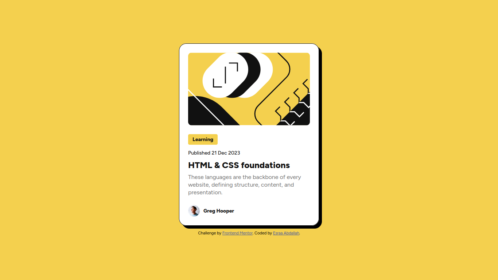

# 📝 Blog Preview Card

## 📸 Screenshot

### Desktop

### Mobile

---

This is a simple **Blog Preview Card** project built using **HTML & CSS**.  
This project is a challenge from **Frontend Mentor**: [Frontend Mentor](https://www.frontendmentor.io)

---

## 🔗 Live Demo

- Live Site: [Click Here](https://esraa-abdallah21010.github.io/Blog-preview-card/)
- GitHub Repo: [Click Here](https://github.com/Esraa-Abdallah21010/Blog-preview-card)

---

## 🛠️ Built With

  
  

---

## ✨ Features

- 📱 Fully responsive design
- 🎨 Clean and modern UI
- 🧱 Semantic HTML structure
- 🎯 Pixel-perfect design based on the challenge

---

## 📚 What I Learned

- Structuring HTML properly
- Styling components using CSS
- Creating a responsive layout
- Working with fonts, colors, and spacing

---

## 🚧 Future Improvements

- ✨ Add hover/focus animations
- ♿ Improve accessibility (ARIA & contrast)
- ⚛️ Rebuild using a JavaScript framework

---

## 👩‍💻 Author

**Esraa Abdallah**  
- GitHub: [@Esraa-Abdallah21010](https://github.com/Esraa-Abdallah21010)  
- Email: esraaabdallah21010@gmail.com

---

## ⭐ Acknowledgments

This project is based on a challenge from [Frontend Mentor](https://www.frontendmentor.io)

---

⭐ If you like this project, feel free to star the repository!
